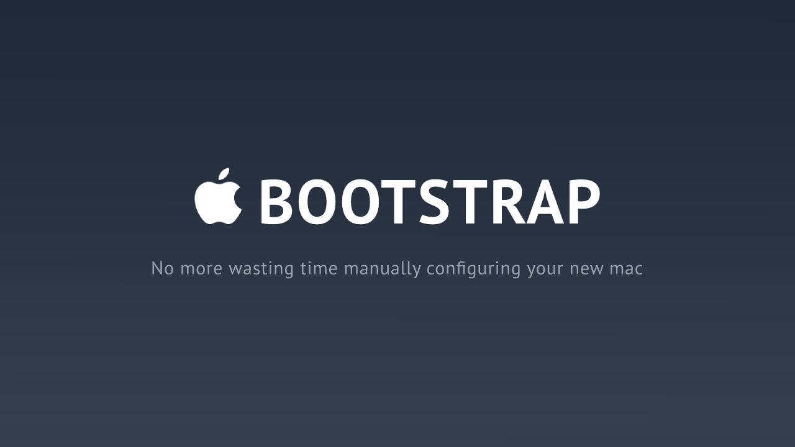
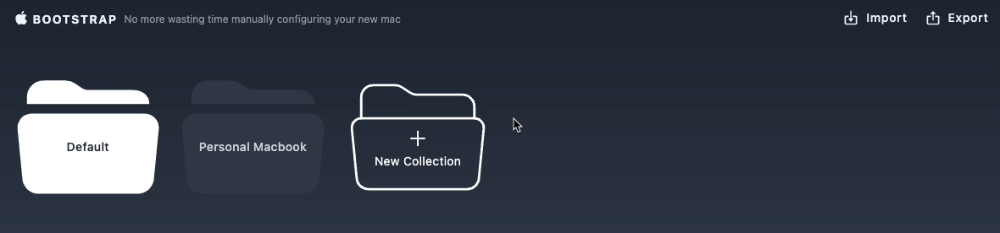
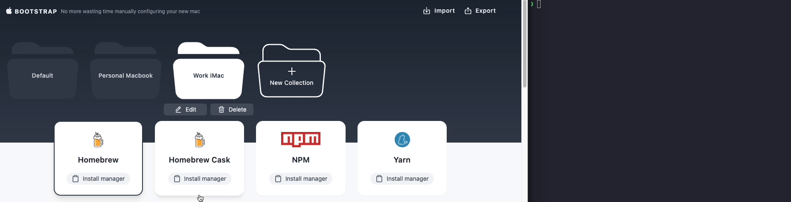
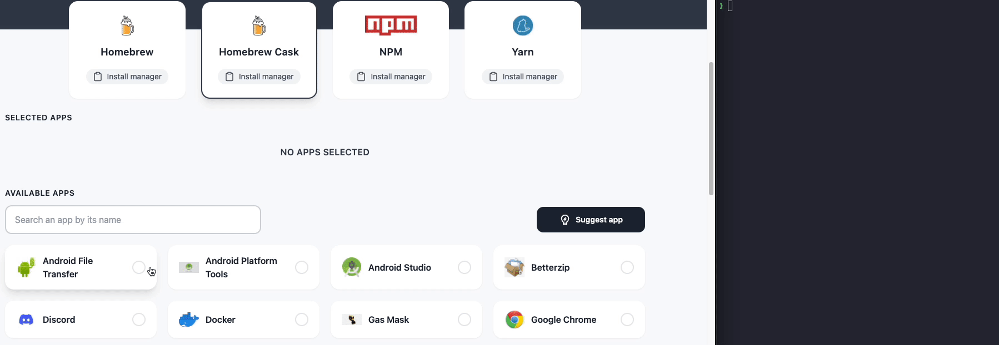
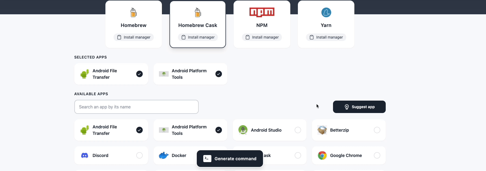
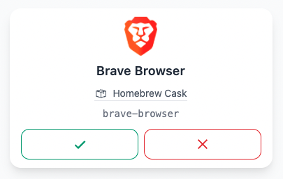

[](https://mac-bootstrap.vercel.app)
[](http://makeapullrequest.com)
[](http://www.firsttimersonly.com/)

# Introduction

#### Have you ever bought or received a brand new (or used) apple computer... cried tears of happiness for having such a magnificent device in your possession... Turned it on... **and then...**

...

## 🤔 Hmm... what apps should I install?
#### 🧹 I want to start from scratch, not installing all the junk from my **Time Machine** backups...

#### 😴 But wasting a day searching through what I want to install is not in my plans either...

#### 😰 What about all those terminal packages I need for work that I don't remember their names or how to list all of them?

...

### 😩 I wish I could have a ready-to-use terminal command to just copy & paste it on the new device and be done with it

---

<p align="center" style="font-size: 1.4rem">
  <a href="https://mac-bootstrap.vercel.app">I'm here for you friend 🦸‍♂️</a>
</p>

---

# Features

## Collections of apps
Imagine you have a personal and a work mac computer... You might not want the same apps installed...



## Install a package manager
To install anything at all from the terminal, you need a package manager installed in the first place...



## Install your apps
Select the apps you want to install for a specific package manager, generate the command, and you are good to go! All your apps will be installed when you come back from a coffee break!



## Suggest an app missing
The list of apps available is inserted by me manually, so the probability you won't find the app you are looking for will be big... This is my way of asking for your contribution to help me get the most complete list possible... After that, I accept your suggestion in the admin area, and it shows automatically on the website

|  |  |
| :---------: | :---------: |
| You suggest | I accept/reject |

## Have control over your data

At any time, you can import or export your data: ```Collections you made``` and ```selected apps for each package manager for a certain```

That data is only stored on your browser, so this is the only way for you to move those choices from a device/browser to another

# Run it locally

```sh
  # Clone this repository
  $ git clone https://github.com/RicardoPBarbosa/mac-bootstrap.git

  # Go into the repository
  $ cd mac-bootstrap

  # Install dependencies
  $ yarn # npm install

  # Setup the environment variables
  $ cp .env.example .env # and fill it with your own firebase info

  # Run the app
  $ yarn dev # npm run dev
```

# Support

<a href="https://www.buymeacoffee.com/ricardopbarbosa"></a>

# License
MIT
